# MeDIAuto Studio SaaS 페이지별 사용자 가이드

> 사용자 매뉴얼 작성용 초안 
> 화면 기준일: 2026-08-21 
> 화면에 표시되는 영문 버튼명은 실제 UI와 쉽게 대조할 수 있도록 그대로 표기했습니다.

영문 버전: [PAGE_FEATURE_GUIDE_EN.md](PAGE_FEATURE_GUIDE_EN.md)

## 이 문서의 목적

이 문서는 시스템 내부 구조가 아니라 사용자가 화면에서 할 수 있는 일을 페이지별로 설명합니다. 처음 접하는 사용자도 아래 순서대로 읽으면 로그인부터 슬라이드 업로드, AI 분석, 주석, 검토까지 전체 업무 흐름을 이해할 수 있습니다.

## 화면 이미지 안내

이 문서의 화면 예시는 사용자명, 로그인 ID, 이름, 부서, 접속 IP·위치 및 샘플 식별자를 모자이크 처리한 공개용 이미지입니다. 실제 화면의 데이터와 버튼 활성 상태는 로그인한 계정의 역할과 작업 상태에 따라 다를 수 있습니다.

## 전체 작업 흐름

1. 계정을 만들고 관리자의 승인을 받습니다.
2. Home 또는 Project에서 작업할 프로젝트를 만듭니다.
3. 프로젝트에 슬라이드를 업로드합니다.
4. AI, Tissue Annotation, Cell Annotation 중 필요한 작업공간을 엽니다.
5. 슬라이드를 선택하고 분석 또는 주석 작업을 수행합니다.
6. 결과를 저장하고 Review와 Termination 단계를 진행합니다.

## 역할별 이용 범위

| 역할 | 주요 이용 범위 |
| --- | --- |
| Admin | 모든 기능, 프로젝트 삭제, 사용자 승인·관리, 시스템 작업 설정 |
| Doctor | 프로젝트 생성·수정, AI 분석, 주석 클래스 설정, 주석·검토·종결 |
| Labeler | AI 실행, 지정된 Tissue/Cell Annotation 작업. 프로젝트와 검토·종결 관리는 제한됨 |
| Viewer | 프로젝트와 슬라이드 및 기존 결과 열람 중심 |

화면에 보이는 버튼은 역할과 현재 작업 상태에 따라 숨겨지거나 비활성화될 수 있습니다.

---

## 1. 로그인 및 회원가입

### 페이지 주소

`/login`

### 로그인하기

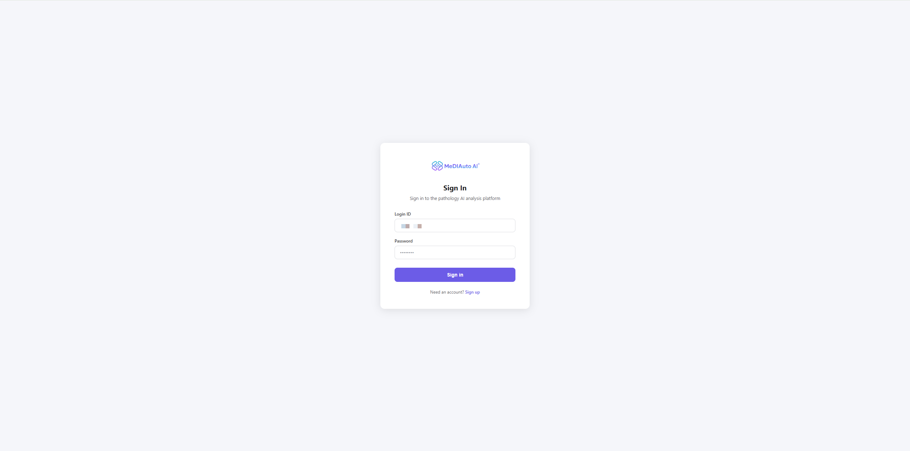

*그림 1. 로그인 화면*

1. `Login ID`를 입력합니다.
2. `Password`를 입력합니다.
3. `Sign in`을 누릅니다.
4. MFA가 설정된 계정은 표시되는 입력란에 6자리 인증 코드를 입력하고 다시 로그인합니다.
5. 로그인이 완료되면 Home 화면으로 이동합니다.

### 계정 만들기

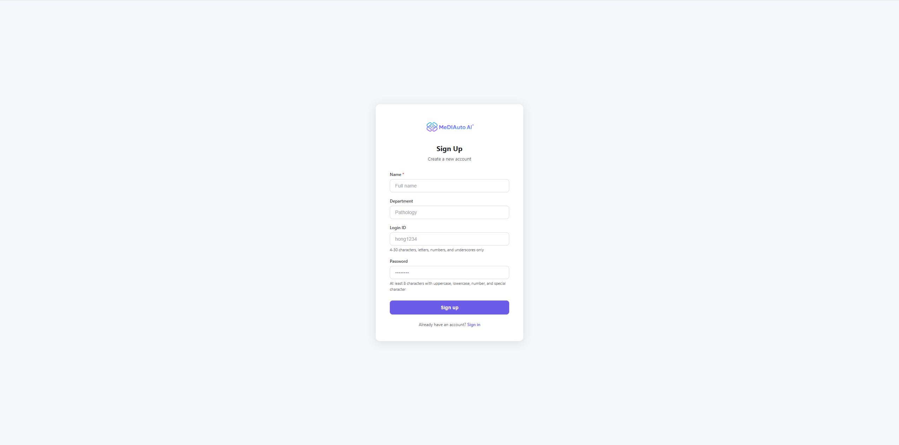

*그림 2. 회원가입 화면*

1. 화면 아래의 `Sign up`을 선택합니다.
2. 다음 항목을 입력합니다.
   - `Name`: 이름, 필수
   - `Department`: 부서, 선택
   - `Login ID`: 로그인할 때 사용할 ID
   - `Password`: 비밀번호
3. `Sign up`을 누릅니다.
4. 가입 신청이 완료되면 관리자의 승인을 기다립니다.
5. 관리자가 계정을 승인하고 역할을 지정한 뒤 로그인할 수 있습니다.

### 입력 규칙

- Login ID는 4~30자의 영문, 숫자, 밑줄만 사용할 수 있습니다.
- 비밀번호는 8자 이상이어야 합니다.
- 비밀번호에는 대문자, 소문자, 숫자, 특수문자가 각각 하나 이상 포함되어야 합니다.

### 로그인이 되지 않을 때

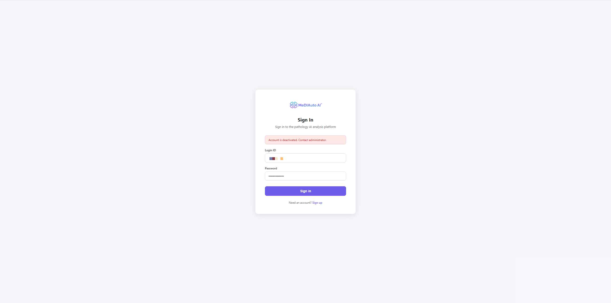

*그림 3. 비활성 계정 로그인 오류 예시*

- `Pending` 또는 승인 대기 메시지: 관리자의 승인이 필요합니다.
- 거절 메시지: 관리자에게 가입 상태를 문의합니다.
- 비활성 계정 메시지: 관리자에게 계정 활성화를 요청합니다.
- 잠금 메시지: 로그인 실패가 누적된 상태입니다. 잠금 시간이 지나기를 기다리거나 관리자에게 해제를 요청합니다.
- 인증 코드 오류: 인증 앱의 시간과 기기의 시간이 맞는지 확인한 뒤 새 코드를 입력합니다.

---

## 2. 공통 상단 메뉴

로그인 후 대부분의 페이지 상단에서 다음 메뉴를 사용할 수 있습니다.

| 메뉴 | 설명 |
| --- | --- |
| Home | 저장공간, 최근 슬라이드, 프로젝트 현황을 확인합니다. |
| Project | 프로젝트를 생성하고 설정합니다. |
| Data Linkage | 같은 케이스의 슬라이드와 임상정보를 연결해 확인합니다. |
| AI | AI 분석 작업공간을 엽니다. |
| Annotation → Tissue Annotation | 조직 영역 단위 주석 작업공간을 엽니다. |
| Annotation → Cell Annotation | 패치 기반 세포 주석 작업공간을 엽니다. |
| Admin | 사용자와 시스템 작업을 관리합니다. Admin에게만 표시됩니다. |

### 사용자 메뉴

- 상단 사용자 이름을 누르면 Profile로 이동합니다.
- 로고 옆 버전 배지를 누르면 Version History로 이동합니다. 버전 검색, 릴리스 계열 필터 및 버전별 변경 내용 펼치기를 사용할 수 있습니다.
- `Logout`을 누르면 현재 계정에서 로그아웃하고 로그인 화면으로 돌아갑니다.

---

## 3. Home 페이지

### 페이지 주소

`/home`

### 화면의 역할

로그인 후 처음 보는 대시보드입니다. 저장공간, 최근 작업, 프로젝트 현황을 한 화면에서 확인하고 자주 쓰는 기능으로 이동할 수 있습니다.

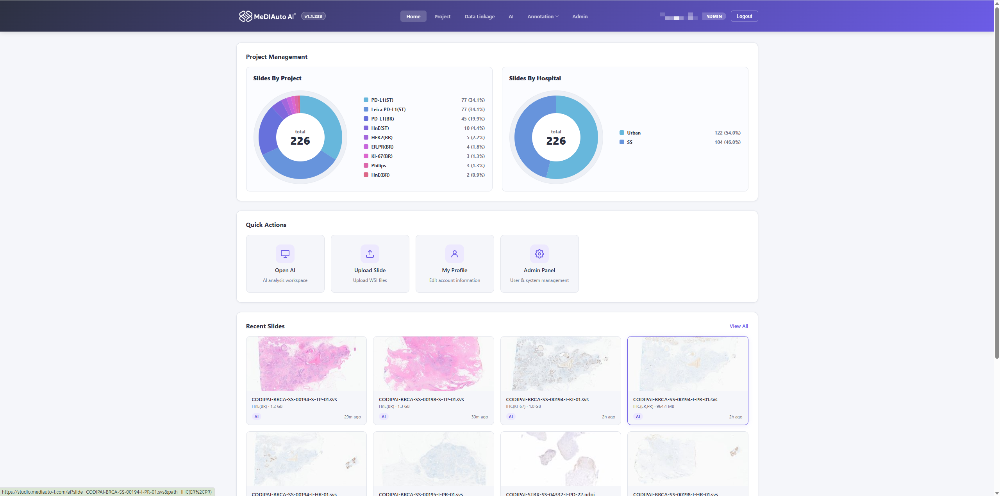

*그림 4. Home 대시보드*

### 저장공간 확인

화면 상단의 저장공간 영역에서 다음 정보를 확인합니다.

- 현재 사용 중인 용량
- 전체 사용 가능한 용량
- 전체 대비 사용률

용량이 거의 찼다면 새 슬라이드를 업로드하기 전에 관리자에게 문의합니다.

### 최근 슬라이드 다시 열기

`Recent Slides` 영역에는 최근 열었던 슬라이드가 표시됩니다.

1. 원하는 슬라이드의 썸네일이나 카드를 찾습니다.
2. 카드를 누릅니다.
3. 해당 슬라이드에서 마지막으로 사용한 AI, Tissue Annotation 또는 Cell Annotation 화면이 열립니다.

카드에서는 파일명, 크기, 최근 작업 시각과 작업 상태를 확인할 수 있습니다.

### Quick Actions

- `AI Viewer`: AI 프로젝트 선택 화면으로 이동합니다.
- `Upload`: 슬라이드 업로드 창을 엽니다.
- `Profile`: 내 정보를 수정합니다.
- `Admin`: 관리자 화면으로 이동합니다.

역할에 따라 Upload 또는 Admin 항목이 표시되지 않을 수 있습니다.

### 프로젝트 현황 확인

- 프로젝트 이름과 상태
- 병원 또는 기관
- 담당자
- 슬라이드 수
- 프로젝트별·병원별 슬라이드 차트
- 목록 페이지 이동

차트의 항목 위에 마우스를 올리면 해당 항목의 상세 수가 표시됩니다.

### 프로젝트 열기

1. 프로젝트 목록에서 작업할 프로젝트의 `Open`을 누릅니다.
2. 열기 창에서 작업 유형을 선택합니다.
   - `AI`
   - `Tissue Annotation`
   - `Cell Annotation`
3. 선택한 작업공간의 슬라이드 목록이 열립니다.

### 프로젝트 정보 확인·수정

- `Info` 또는 Edit 동작을 선택합니다.
- 프로젝트의 제목, 병원, 부서, 담당자, 상태, 마감일, 설명을 확인합니다.
- Admin 또는 Doctor는 내용을 변경할 수 있습니다.

---

## 4. Project 페이지

### 페이지 주소

`/project`

### 화면의 역할

프로젝트를 만들고 프로젝트별 작업 정보와 자동 AI 설정을 관리합니다. Home과 비슷한 대시보드가 표시되지만 프로젝트 관리에 초점을 둔 메뉴입니다.

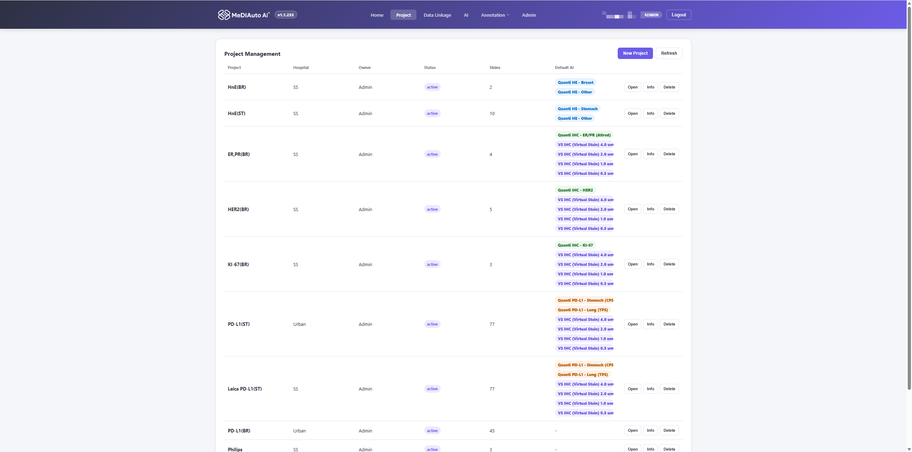

*그림 5. Project 목록 화면*

### 새 프로젝트 만들기

Admin 또는 Doctor가 사용할 수 있습니다.

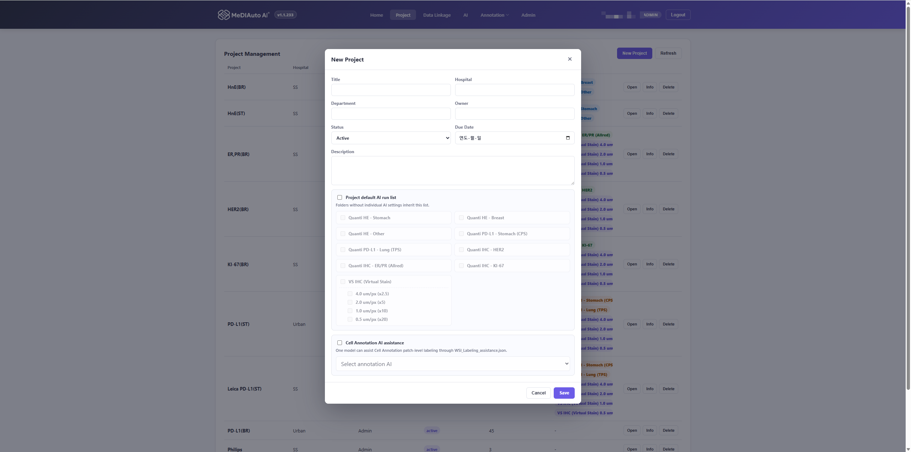

*그림 6. 새 프로젝트 만들기 화면*

1. `New Project`를 누릅니다.
2. 프로젝트 정보를 입력합니다.
   - `Title`: 프로젝트 제목
   - `Hospital`: 병원 또는 기관
   - `Department`: 부서
   - `Owner`: 담당자
   - `Status`: 프로젝트 상태
   - `Due Date`: 마감일
   - `Description`: 설명
3. 필요한 경우 자동 AI 설정을 선택합니다.
4. `Save` 또는 생성 버튼을 누릅니다.

### 프로젝트 상태

| 상태 | 권장 사용 예시 |
| --- | --- |
| Active | 새로 생성되어 작업 가능한 프로젝트 |
| In Progress | 현재 작업 중인 프로젝트 |
| Review | 결과 검토 중인 프로젝트 |
| Done | 작업이 완료된 프로젝트 |
| Archived | 보관된 프로젝트 |

상태의 업무적 의미는 기관 운영 규칙에 맞게 통일해서 사용합니다.

### 프로젝트 수정

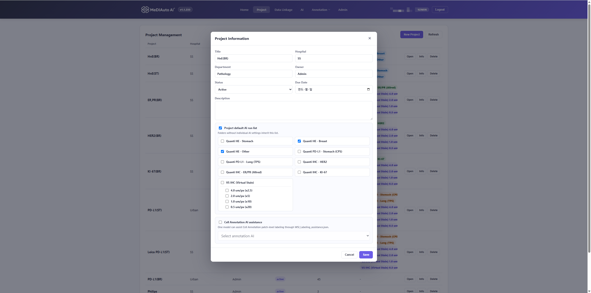

*그림 7. 프로젝트 정보 및 자동 AI 설정 편집 화면*

1. 프로젝트 목록에서 `Info` 또는 Edit를 누릅니다.
2. 필요한 항목을 변경합니다.
3. 저장합니다.

Labeler와 Viewer는 프로젝트 정보를 볼 수 있지만 프로젝트 생성·수정은 할 수 없습니다.

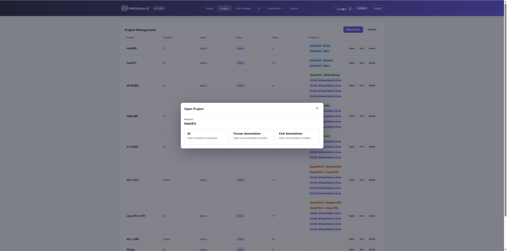

*그림 8. 프로젝트 작업공간 선택 화면*

### 프로젝트 자동 AI 설정

프로젝트에 슬라이드가 추가된 뒤 시스템이 유휴 상태일 때 지정한 분석을 자동으로 실행하도록 설정할 수 있습니다.

선택 가능한 작업:

- Quanti HE: Stomach, Breast, Other
- Quanti PD-L1: Stomach CPS, Lung TPS
- Quanti IHC: HER2, ER/PR Allred, KI-67
- VS IHC: IHC → Virtual H&E

VS IHC는 Target Resolution을 함께 선택합니다.

| 설정 | 표시 배율 | 특징 |
| --- | --- | --- |
| 4.0 µm/px | 약 ×2.5 | 빠르고 거친 결과 |
| 2.0 µm/px | 약 ×5 | 기본적인 검토용 |
| 1.0 µm/px | 약 ×10 | 더 세밀한 결과 |
| 0.5 µm/px | 약 ×20 | 가장 세밀하지만 처리 시간이 길어질 수 있음 |

### Cell Annotation AI assistance 설정

Cell Annotation에서 패치 라벨링을 보조할 모델 하나를 선택할 수 있습니다.

1. Cell Annotation assistance를 켭니다.
2. 슬라이드 염색과 작업 목적에 맞는 모델을 선택합니다.
3. 프로젝트를 저장합니다.

설정을 변경하면 이후 생성되는 보조 결과와 클래스 구성이 달라질 수 있으므로 작업 시작 전에 모델을 확정하는 것이 좋습니다.

### 프로젝트 삭제

- Admin만 삭제할 수 있습니다.
- 슬라이드나 하위 폴더가 없는 빈 프로젝트만 삭제할 수 있습니다.
- 삭제 확인 창에서 프로젝트 이름을 다시 확인합니다.

---

## 5. AI·Annotation 공통 프로젝트 선택 화면

AI, Tissue Annotation, Cell Annotation 메뉴를 바로 열면 먼저 프로젝트 선택 화면이 표시됩니다.

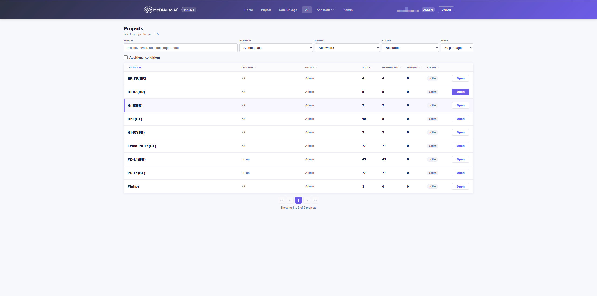

*그림 9. 작업공간의 프로젝트 선택 화면*

### 프로젝트 검색

검색창은 다음 내용을 함께 검색합니다.

- 프로젝트 이름과 제목
- 담당자
- 병원
- 부서
- 상태
- 설명

### 필터

- `Hospital`
- `Owner`
- `Status`
- `Rows`: 페이지당 10, 30 또는 50개

### Additional conditions

`Additional conditions`를 켜면 다음 조건을 추가할 수 있습니다.

- `Has slides`: 슬라이드가 있는 프로젝트만 표시
- `Has folders`: 하위 폴더가 있는 프로젝트만 표시
- `Min slides`: 지정한 수 이상의 슬라이드가 있는 프로젝트만 표시

### 정렬

표의 제목을 누르면 다음 항목을 오름차순 또는 내림차순으로 정렬합니다.

- Project
- Hospital
- Owner
- Slides
- AI Analyzed
- Folders
- Status

### 프로젝트 열기

원하는 프로젝트 행 또는 `Open`을 누르면 해당 작업공간으로 들어갑니다.

---

## 6. Upload 페이지

### 페이지 주소

`/upload`

### 화면의 역할

프로젝트와 폴더를 선택해 WSI 파일을 업로드합니다. Home이나 각 작업공간에서 별도 팝업 창으로 열립니다.

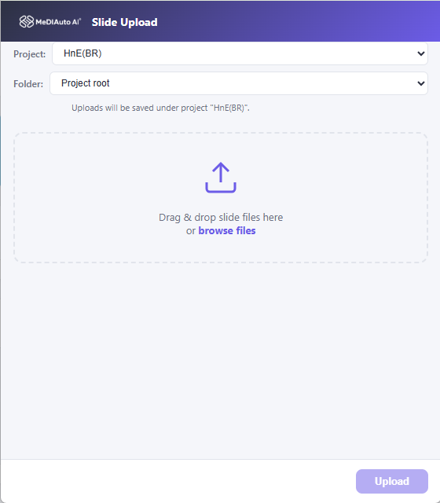

*그림 10. Slide Upload 화면*

### 업로드 위치 선택

1. `Project`에서 대상 프로젝트를 선택합니다.
2. 필요한 경우 하위 `Folder`를 선택합니다.
3. 현재 작업공간에서 Upload를 연 경우 현재 프로젝트와 폴더가 미리 선택될 수 있습니다.

프로젝트 선택은 필수입니다.

### 파일 추가

다음 방법 중 하나를 사용합니다.

- 파일 선택 영역을 눌러 파일 탐색기에서 선택
- 파일을 업로드 영역으로 drag & drop
- 여러 파일을 한 번에 선택

### 지원 파일

- SVS
- NDPI
- VMS, VMU
- SCN
- MRXS
- TIFF, TIF
- PNG
- JPG, JPEG
- DICOM WSI ZIP
- Philips iSyntax, i2syntax

JPG/JPEG는 업로드할 때 OpenSlide 호환 pyramidal tiled BigTIFF로 변환됩니다. 원본 파일에 배율과 물리적 해상도 정보가 없으므로 `20×` 및 `0.5 µm/px`로 고정하여 등록하며, 표시 배율과 길이 측정값도 이 고정값을 기준으로 계산됩니다. 변환이 완료되면 슬라이드 목록에는 같은 이름의 `.tiff` 파일로 표시됩니다.

DICOM WSI는 한 장의 물리 슬라이드에 속한 DICOM 인스턴스를 하나의 ZIP 파일로 묶어 업로드합니다. 시스템은 ZIP 안의 해상도 단계와 색상 프로파일을 읽어 일반 WSI와 같은 방식으로 확대·축소하고, 썸네일과 타일을 표시합니다. 서로 다른 슬라이드가 한 ZIP에 섞여 있으면 등록되지 않습니다.

한 파일의 최대 크기는 기본 20 GB입니다.

### 업로드 진행

- 파일은 목록 순서대로 하나씩 처리됩니다.
- 각 파일의 진행률이 표시됩니다.
- 전송이 끝난 뒤 파일 등록·검사 단계가 이어질 수 있습니다.
- 업로드 중에는 창을 닫지 않습니다.
- 창을 닫으려고 하면 작업 중이라는 경고가 표시됩니다.
- 한 파일이 실패해도 나머지 파일은 계속 처리됩니다.

### 동일 파일이 이미 있을 때

충돌 화면에서 각 파일을 개별 선택합니다.

- `Overwrite`: 기존 파일과 관련 작업 데이터를 제거하고 새 파일로 교체
- `Skip`: 기존 파일을 유지하고 이번 파일은 건너뜀

Overwrite는 기존 AI 결과와 주석 작업에도 영향을 줄 수 있으므로 신중하게 선택합니다.

### 업로드 완료

마지막에 다음 수를 확인합니다.

- `Uploaded`: 성공
- `Failed`: 실패
- `Skipped`: 건너뜀

업로드 창을 닫으면 원래 작업공간의 슬라이드 목록이 갱신됩니다.

### 업로드가 실패할 때

- 지원하는 확장자인지 확인합니다.
- 프로젝트가 선택되어 있는지 확인합니다.
- 파일이 손상되지 않았는지 확인합니다.
- 저장공간이 충분한지 확인합니다.
- 네트워크가 끊기지 않았는지 확인합니다.
- Philips 파일은 해당 서버에 Philips 지원 환경이 준비되어 있어야 합니다.

---

## 7. AI·Tissue·Cell 공통 슬라이드 목록

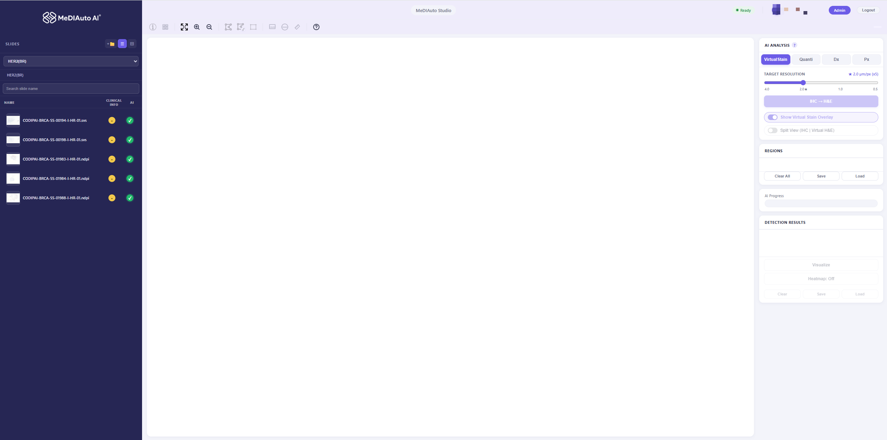

*그림 11. 슬라이드 List View*

### 폴더 이동

- Breadcrumb의 프로젝트 또는 폴더 이름을 눌러 상위 위치로 이동합니다.
- 폴더를 더블클릭하거나 눌러 하위 폴더로 들어갑니다.
- 권한이 있으면 새 폴더를 만들고 이름을 바꾸거나 삭제할 수 있습니다.

### 슬라이드 검색

검색창에 파일명의 일부를 입력하면 현재 폴더의 슬라이드가 필터링됩니다.

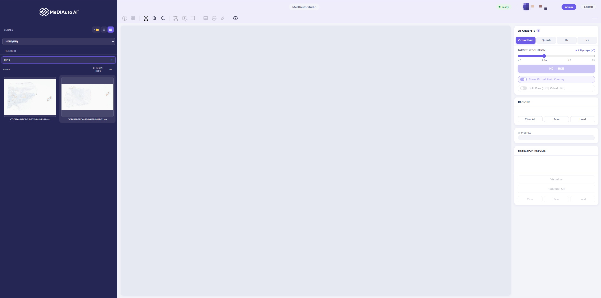

*그림 12. 슬라이드 이름 검색 결과*

### 목록·그리드 보기

- List View: 파일명과 상태를 표 형태로 확인
- Grid View: 큰 썸네일 중심으로 확인

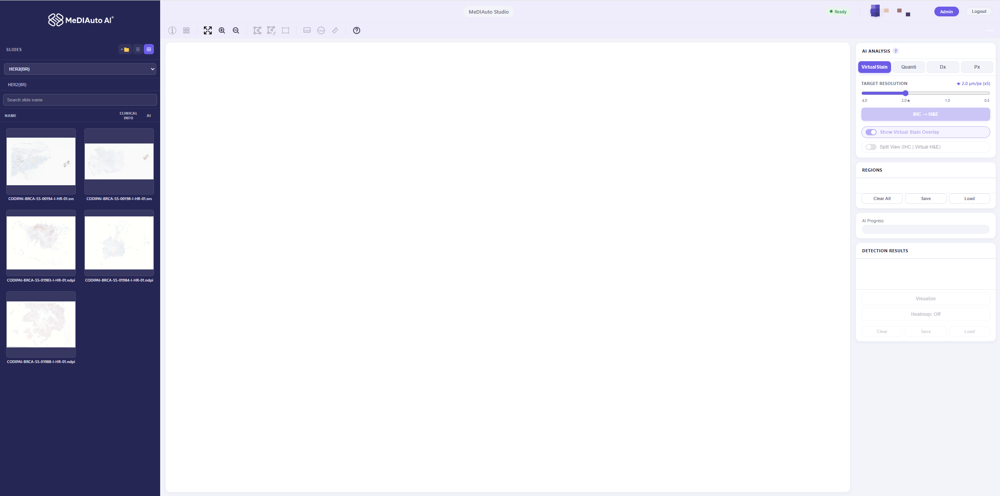

*그림 13. 슬라이드 Grid View*

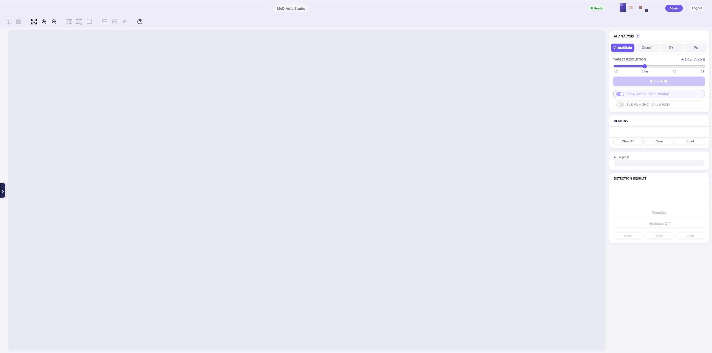

*그림 14. 슬라이드 패널 접기 상태*

### 여러 슬라이드 선택

| 조작 | 결과 |
| --- | --- |
| Ctrl/Cmd+클릭 | 선택 항목을 추가하거나 해제 |
| Shift+클릭 | 마지막 선택부터 현재 항목까지 범위 선택 |
| 빈 영역 드래그 | 사각 선택 영역 안의 여러 항목 선택 |

### 파일 이동

1. 하나 이상의 슬라이드를 선택합니다.
2. 선택 항목을 대상 폴더 또는 Breadcrumb 위치로 끌어 놓습니다.
3. 이동 후 목록을 확인합니다.

파일 이동은 기존 결과나 주석의 경로와 연결될 수 있으므로 작업 중인 슬라이드는 이동하지 않는 것이 안전합니다.

### 썸네일 크기

왼쪽 슬라이드 목록 위에서 `Ctrl+마우스 휠`을 사용하면 썸네일 크기를 변경할 수 있습니다.

### 우클릭 메뉴

슬라이드나 폴더를 우클릭하면 현재 역할과 항목에 맞는 메뉴가 표시됩니다. 삭제 전에는 대상 파일명과 선택 개수를 반드시 확인합니다.

---

## 8. 공통 WSI Viewer 사용법

AI, Tissue Annotation, Cell Annotation은 같은 기본 WSI 조작 방식을 사용합니다.

### 화면 이동과 확대

| 조작 | 동작 |
| --- | --- |
| 좌클릭 드래그 | 슬라이드 이동 |
| 가운데 버튼 드래그 | 슬라이드 이동 |
| 마우스 휠 | 화면 중앙을 기준으로 확대·축소 |
| 한 손가락 드래그 | 터치 화면 이동 |
| 두 손가락 pinch | 터치 확대·축소 |
| `Fit` | 슬라이드 전체가 화면에 맞도록 표시 |
| `Zoom In`, `Zoom Out` | 단계별 확대·축소 |

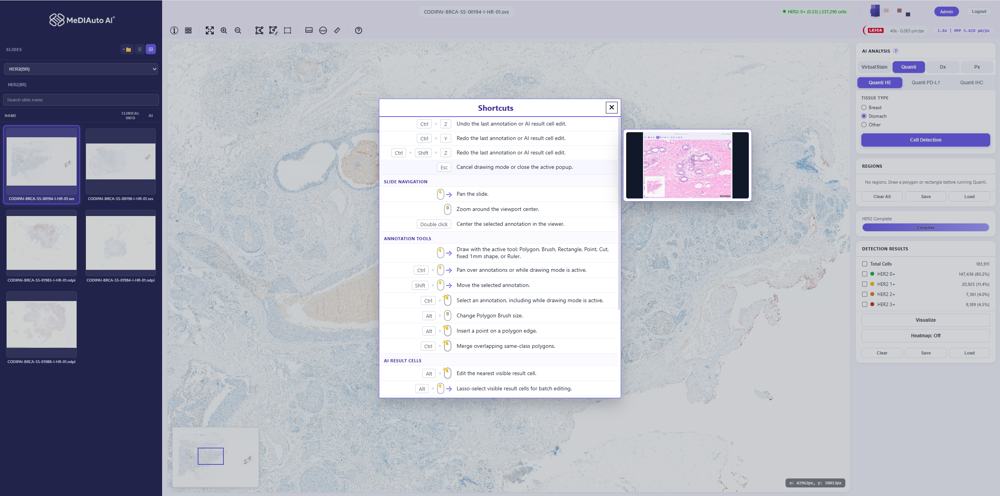

*그림 15. Viewer 도구 및 단축키 도움말*

### 미니맵

- 미니맵에서 현재 보고 있는 영역을 사각형으로 확인합니다.
- 미니맵을 클릭하면 해당 위치로 이동합니다.
- 현재 영역 사각형을 드래그해 빠르게 이동합니다.
- 미니맵 크기를 조절하거나 접을 수 있습니다.

### 좌우 패널

- 패널 경계를 드래그해 폭을 조절합니다.
- 패널을 접어 Viewer를 넓게 사용할 수 있습니다.
- 접힌 패널의 경계에서 Enter 또는 Space를 누르면 다시 열립니다.
- 작은 화면에서는 패널이 drawer로 표시됩니다.

### 슬라이드 정보

`Slide Info`에서 다음 정보를 확인합니다.

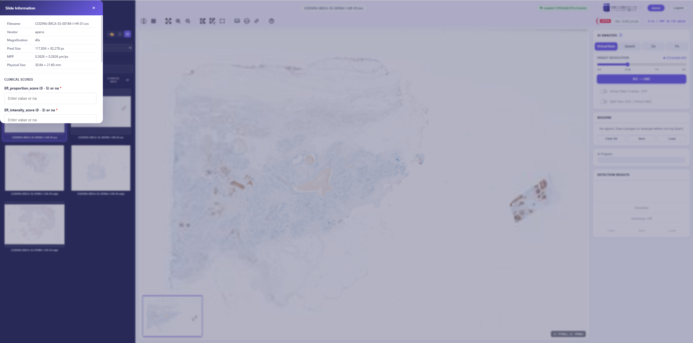

*그림 16. Slide Info 화면*

- 파일명
- Scanner/Vendor
- 배율
- 픽셀 크기
- MPP
- 실제 물리 크기
- 임상정보

임상정보를 수정한 뒤 창을 닫으면 변경 내용이 자동 저장될 수 있습니다.

### Hamamatsu 색상

Hamamatsu 슬라이드에서는 NDP 색보정 옵션이 표시될 수 있습니다. 원본 보기와 보정 보기를 전환해 기관에서 사용하는 기준 화면과 비교합니다.

### Same Case

같은 환자·샘플의 다른 marker 슬라이드를 찾을 때 사용합니다.

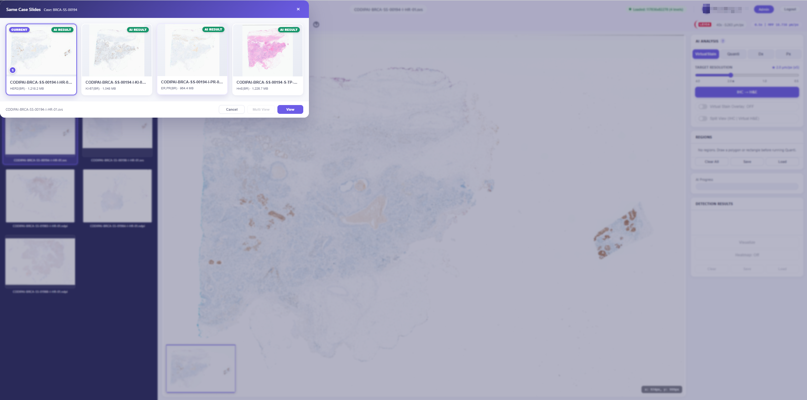

*그림 17. Same Case 슬라이드 선택 화면*

1. `Same Case`를 누릅니다.
2. 검색된 슬라이드의 썸네일과 AI 결과 표시를 확인합니다.
3. 최대 4개까지 선택합니다.
4. 한 장만 보려면 단일 View를 선택합니다.
5. 여러 장을 비교하려면 Multi View를 선택합니다.

### Multi View

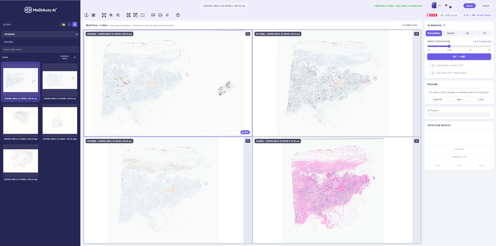

*그림 18. 기본 Multi View 화면*

- 2~4개 슬라이드를 동시에 표시합니다.
- 각 화면의 `Fit`을 개별 사용할 수 있습니다.
- 작업할 화면을 클릭하면 활성 슬라이드가 바뀝니다.
- AI, Annotation, Info 동작은 활성 슬라이드에 적용됩니다.
- Multi View를 닫으면 원래 슬라이드 화면으로 돌아갑니다.

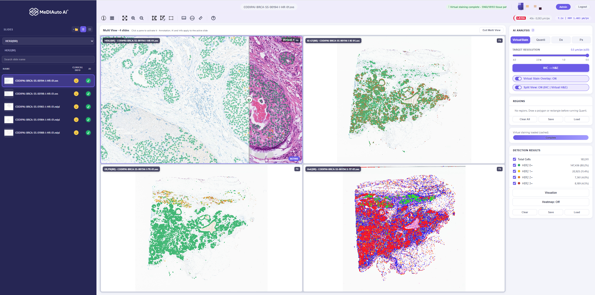

*그림 19. Same Case AI 분석 결과 Multi View 화면*

---

## 9. AI 페이지

### 페이지 주소

`/ai`

### 화면의 역할

전체 슬라이드 또는 지정한 ROI에 AI 분석을 실행하고 결과 셀, 점수, 시각화 자료를 검토합니다.

### 작업 시작

1. AI 메뉴를 엽니다.
2. 프로젝트를 선택합니다.
3. 왼쪽 목록에서 슬라이드를 엽니다.
4. 필요하면 ROI를 그립니다.
5. 오른쪽 AI 영역에서 분석 종류를 선택합니다.
6. 분석 버튼을 누릅니다.
7. 진행률이 완료될 때까지 기다립니다.

### ROI 도구

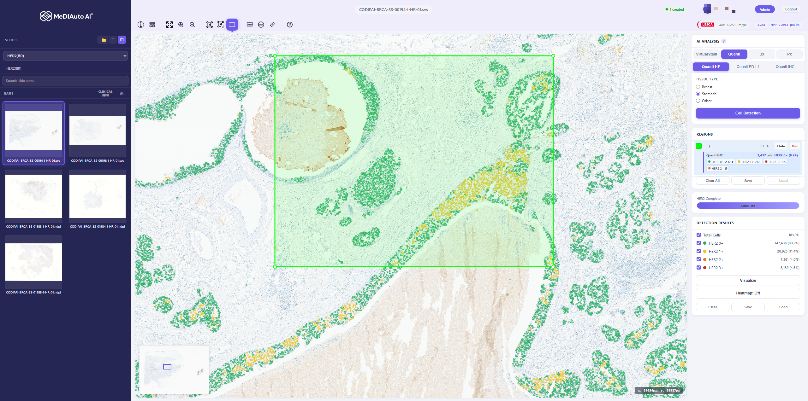

*그림 20. AI 분석 영역 ROI 설정 화면*

| 도구 | 사용 방법 |
| --- | --- |
| Polygon | 원하는 영역의 경계를 드래그하여 둘러쌉니다. |
| Polygon Brush | 붓처럼 드래그하여 자유 영역을 만듭니다. |
| Rectangle | 시작점에서 끝점까지 드래그합니다. |
| 1 mm² Rectangle | 원하는 위치에 고정 면적 사각형을 만듭니다. |
| 1 mm² Circle | 원하는 위치에 고정 면적 원을 만듭니다. |
| Ruler | 두 지점을 연결해 실제 거리를 측정합니다. |

보이는 Polygon 또는 Rectangle ROI가 있으면 해당 영역만 분석합니다. ROI가 없으면 전체 슬라이드를 분석합니다.

### ROI 수정

- ROI를 클릭해 선택합니다.
- 꼭짓점 또는 사각형 모서리를 드래그해 형태를 수정합니다.
- `Shift+드래그`로 ROI 전체를 이동합니다.
- `Alt+polygon 경계 클릭`으로 꼭짓점을 추가합니다.
- 같은 클래스의 겹친 polygon에서 `Ctrl+클릭`하면 병합합니다.
- `Delete`로 선택 ROI를 삭제합니다.
- `Esc` 또는 우클릭으로 그리기 모드를 종료합니다.

### VirtualStain

IHC 원본에서 Virtual H&E 영상을 생성합니다.

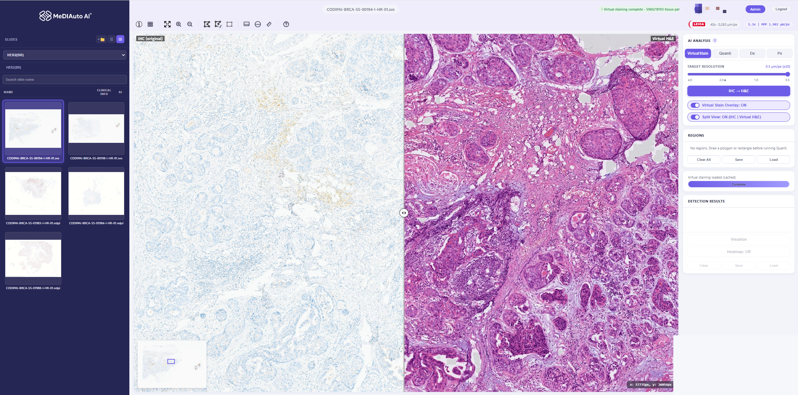

*그림 21. Virtual Stain Split View*

1. `VirtualStain`을 선택합니다.
2. Target Resolution을 선택합니다.
3. 실행 버튼을 누릅니다.
4. 완료 후 `Overlay`를 켜서 원본 위에 결과를 겹쳐 봅니다.
5. `Split View`를 켜서 왼쪽 IHC와 오른쪽 Virtual H&E를 비교합니다.
6. 가운데 경계를 드래그해 비교 비율을 조절합니다.

낮은 MPP 값은 더 세밀하지만 처리 시간이 길고 더 많은 자원을 사용할 수 있습니다.

### Quanti HE

H&E 슬라이드의 세포를 검출하고 분류합니다.

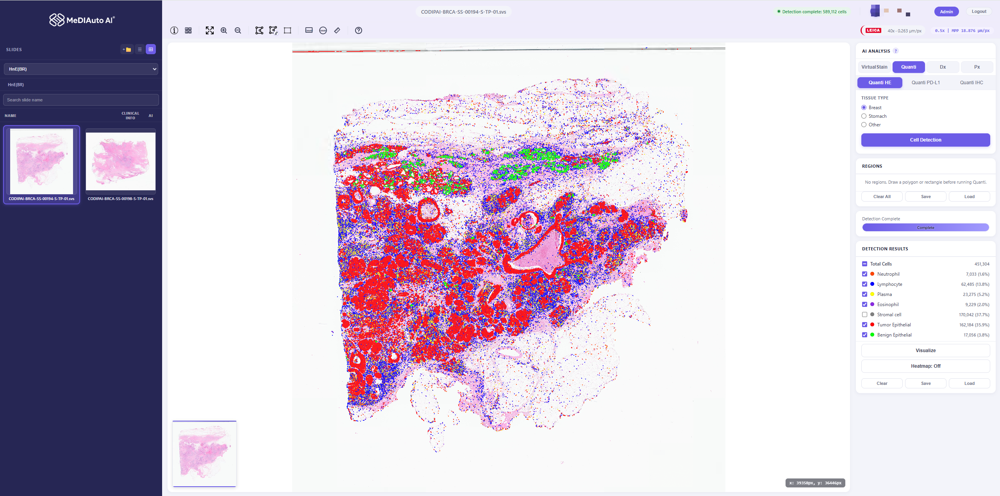

*그림 22. Quanti HE 분석 결과*

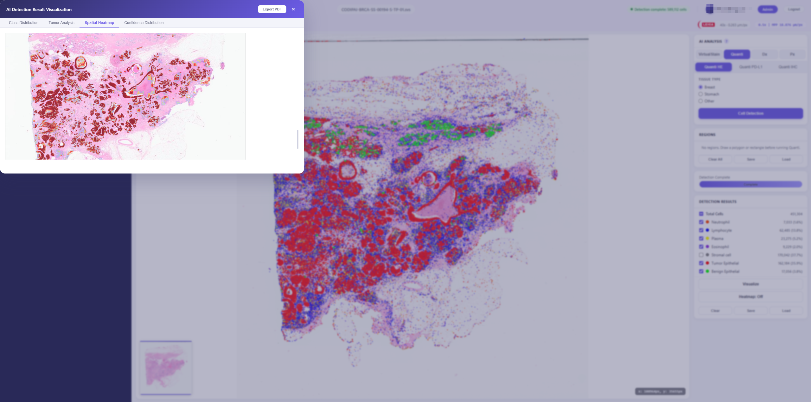

*그림 23. Quanti HE Spatial Heatmap*

1. `Quanti`에서 `HE`를 선택합니다.
2. `Breast`, `Stomach`, `Other` 중 조직에 맞는 항목을 선택합니다.
3. 분석을 실행합니다.
4. 결과 목록에서 각 세포 클래스의 개수를 확인합니다.

표시되는 주요 클래스:

- Neutrophil
- Epithelial
- Lymphocyte
- Plasma
- Eosinophil
- Stromal cell
- Tumor Epithelial
- Benign Epithelial

Breast와 Stomach는 epithelial cell을 Tumor와 Benign으로 추가 구분합니다.

### Quanti PD-L1

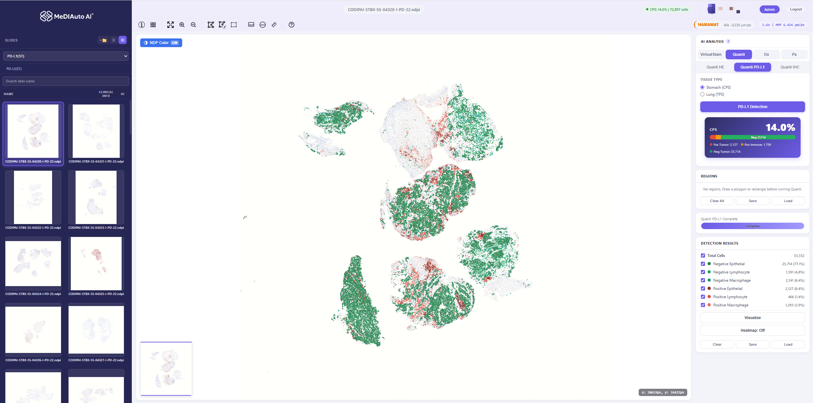

*그림 24. Quanti PD-L1 분석 결과*

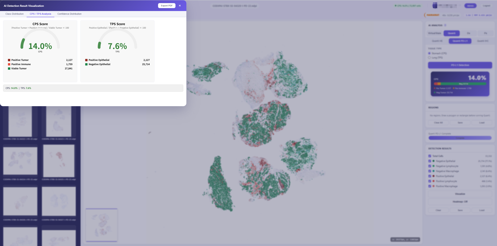

*그림 25. PD-L1 CPS·TPS 결과 확인*

1. `Quanti`에서 `PD-L1`을 선택합니다.
2. 위 조직을 선택합니다.
   - `Stomach`: CPS
   - `Lung`: TPS
3. 분석을 실행합니다.
4. 결과 셀 수와 계산된 점수를 확인합니다.

Stomach CPS는 양성 종양세포와 양성 면역세포를 viable tumor cell 수와 비교합니다. Lung TPS는 양성 종양세포를 전체 종양세포 수와 비교합니다.

Other 또는 Non-Tumor로 분류된 셀은 기본적으로 숨겨지며 점수에서 제외됩니다.

### Quanti IHC

#### HER2

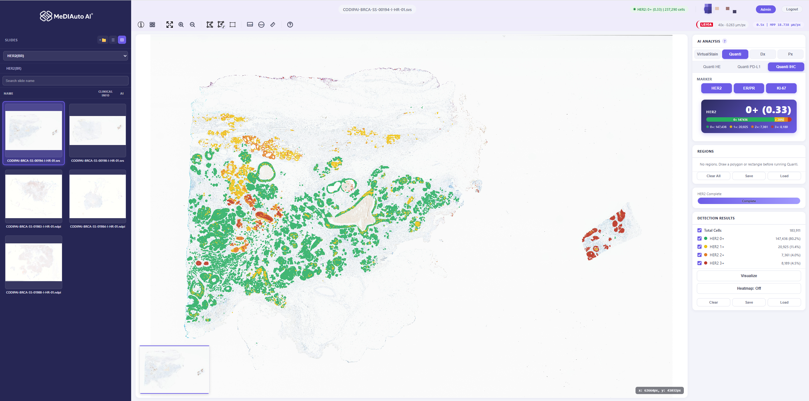

*그림 26. Quanti IHC HER2 분석 결과*

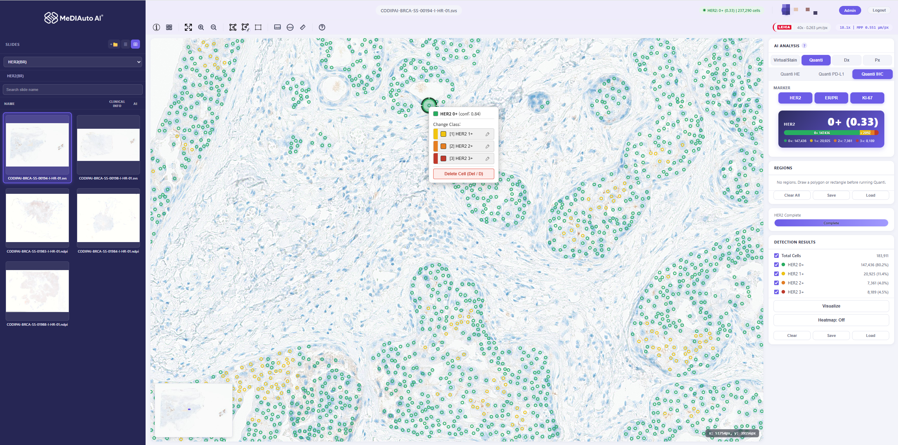

*그림 27. HER2 단일 결과 셀 편집*

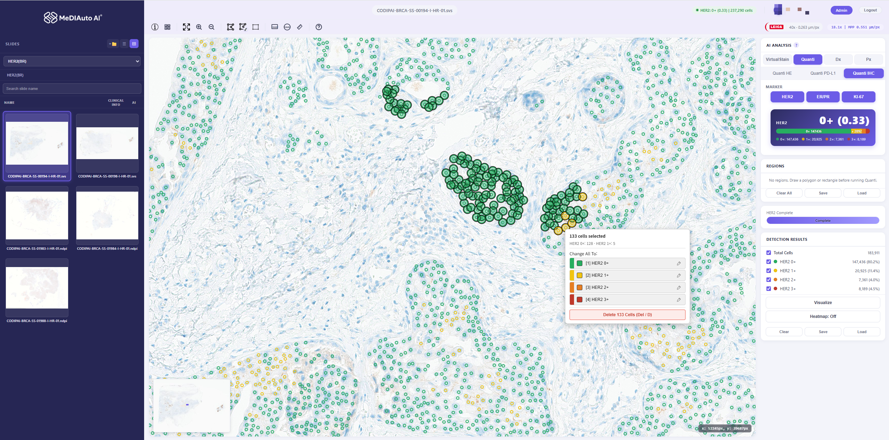

*그림 28. HER2 결과 셀 다중 편집*

- 0+, 1+, 2+, 3+ 세포 수
- 가장 많은 등급
- 전체 세포의 가중 평균 점수

#### ER/PR

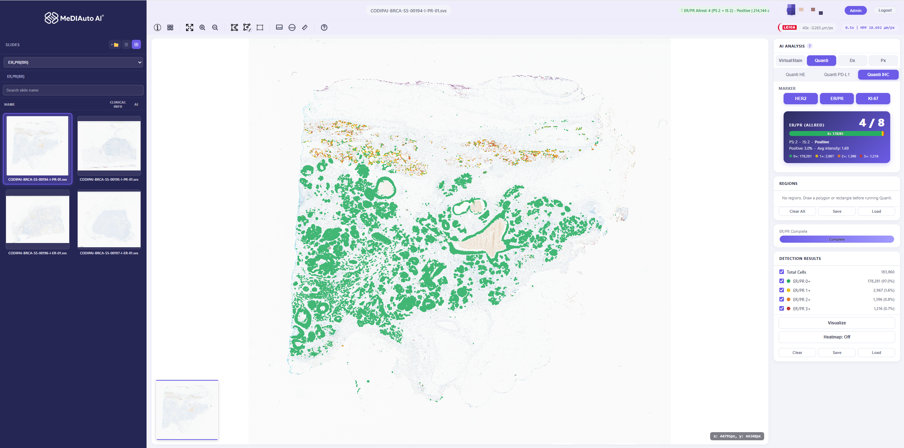

*그림 29. Quanti IHC ER·PR 분석 결과*

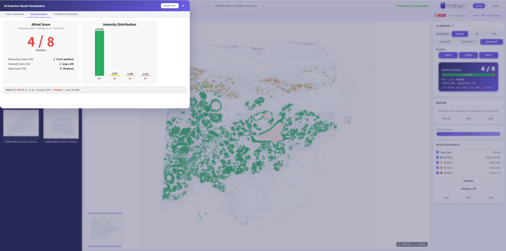

*그림 30. Allred 분석 시각화*

- Proportion Score
- Intensity Score
- 두 값을 합한 Allred Total Score
- Positive 또는 Negative 표시

#### KI-67

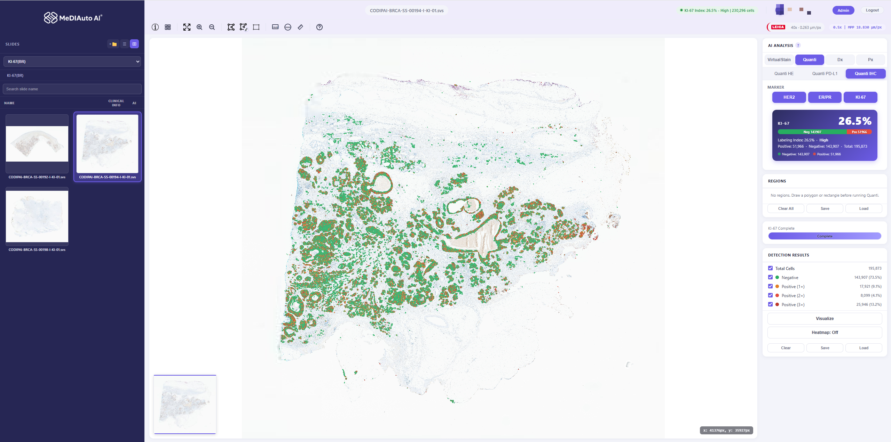

*그림 31. Quanti IHC KI-67 분석 결과*

- 양성 세포 수
- 음성 세포 수
- Positive / Total 비율
- 14% 기준 High 또는 Low 표시

### 분석 진행·취소

- 분석 중에는 진행률과 현재 상태가 표시됩니다.
- 같은 실행 버튼을 다시 누르면 취소 여부를 묻거나 취소 요청을 보낼 수 있습니다.
- 큰 슬라이드는 결과가 표시되기까지 시간이 걸릴 수 있습니다.
- 왼쪽 목록의 상태 badge에서도 실행 중·완료 상태를 확인할 수 있습니다.

### 결과 표시 관리

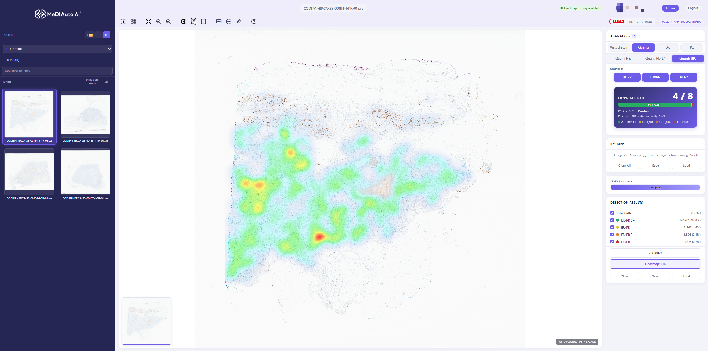

*그림 32. AI 결과 Heatmap 표시*

- 클래스 이름 옆 표시 아이콘으로 해당 클래스의 셀을 숨기거나 다시 표시합니다.
- 전체 표시/숨김을 사용할 수 있습니다.
- 숨김은 화면과 점수 검토에 영향을 줄 수 있으므로 어떤 클래스가 숨겨졌는지 확인합니다.
- Heatmap 버튼으로 밀도 분포를 켜거나 끕니다.

### 결과 셀 수정

Admin과 Doctor가 사용할 수 있습니다.

| 조작 | 동작 |
| --- | --- |
| Alt+좌클릭 | 가까운 결과 셀을 선택해 클래스 변경 |
| Alt+좌드래그 | 여러 가시 셀을 자유 영역으로 선택 |
| Alt+우클릭 | 클릭한 위치에 새 결과 셀 추가 |
| Alt+우드래그 | 숨겨진 Other 셀을 여러 개 선택해 가시 클래스로 변경 |
| Alt+A | 반복 적용할 Sticky Class 선택 |
| 1~9, 0 | 열린 편집창에서 클래스 1~10 선택 |
| Delete 또는 D | 선택 셀 삭제 |
| Ctrl+Z | 이전 편집 취소 |
| Ctrl+Y 또는 Ctrl+Shift+Z | 취소한 편집 다시 적용 |

셀을 수정하면 CPS, TPS, HER2, Allred, KI-67 값이 바로 다시 계산됩니다.

### 결과 저장

- `Save Results`: 현재 편집 결과를 내 저장본으로 저장합니다.
- `Load Results`: 원본 AI 결과 또는 저장된 사용자 결과를 선택해 불러옵니다.
- 내 저장본은 삭제할 수 있습니다.
- `Clear Results`: 현재 화면의 결과 표시를 비웁니다.

Clear와 사용자 저장본 삭제가 원본 AI 분석 결과까지 삭제하는 것은 아닙니다.

Labeler는 AI를 실행할 수 있지만 결과 셀 편집과 Save/Load가 제한됩니다. Viewer는 AI 실행이 제한됩니다.

### Visualize

`Visualize`에서 다음 자료를 확인합니다.

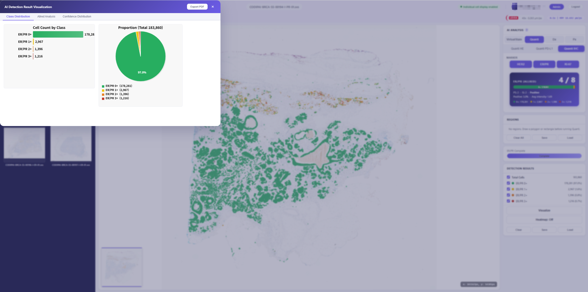

*그림 33. 클래스 분포 시각화*

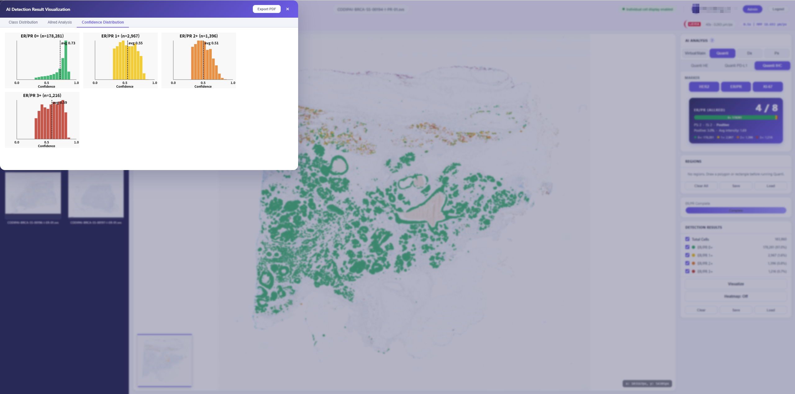

*그림 34. Confidence 분포 시각화*

- 클래스 분포 bar chart
- 클래스 분포 pie chart
- 모델별 분석 결과
- Spatial Heatmap
- Segmentation Map
- Confidence 분포

### PDF 저장

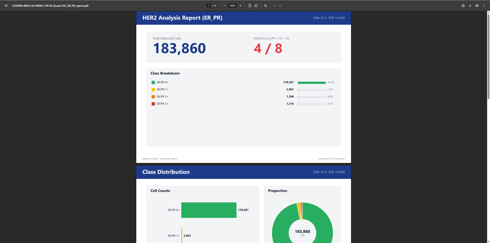

*그림 35. AI 분석 PDF 보고서*

1. Visualize 창에서 PDF Export를 선택합니다.
2. 브라우저가 저장 위치 선택을 지원하면 파일 위치와 이름을 지정합니다.
3. 지원하지 않으면 기본 다운로드 폴더에 저장됩니다.

폐쇄망에서 PDF 기능이 동작하지 않는 경우 관리자에게 문의합니다.

---

## 10. Tissue Annotation 페이지

### 페이지 주소

`/annotation` 또는 `/tissue-annotation`

### 화면의 역할

슬라이드의 조직 영역을 클래스별로 표시하고 작업·검토·종결 상태를 관리합니다.

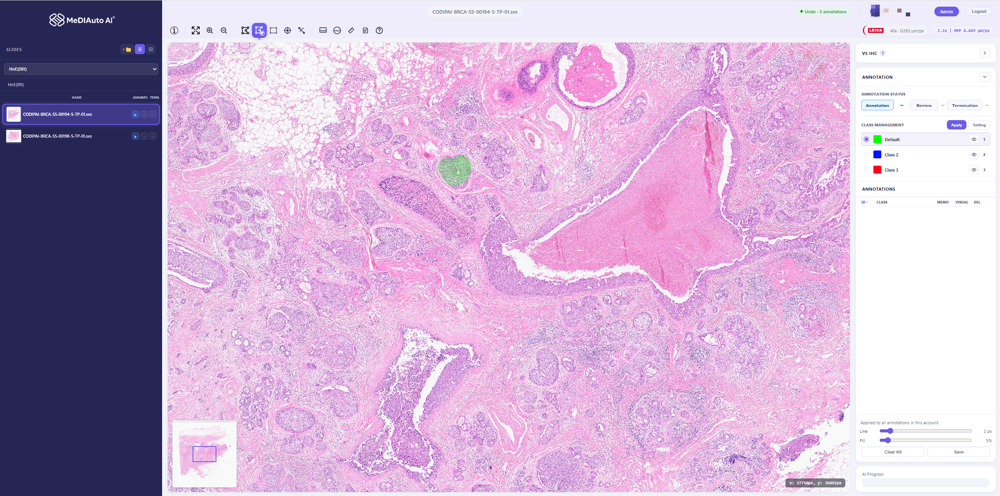

*그림 36. Tissue Annotation 작업 화면*

### 작업 시작

1. Tissue Annotation 메뉴를 엽니다.
2. 프로젝트를 선택합니다.
3. 왼쪽 목록에서 슬라이드를 엽니다.
4. 오른쪽에서 사용할 클래스를 선택합니다.
5. 상단에서 그리기 도구를 선택합니다.
6. Viewer에서 영역을 그립니다.
7. Memo와 클래스를 확인합니다.
8. `Save` 또는 `Ctrl+S`로 저장합니다.

슬라이드를 열면 기존에 저장한 주석이 자동으로 불러와집니다.

### 그리기 도구

| 도구 | 설명 |
| --- | --- |
| Polygon | 드래그한 경로를 닫힌 영역으로 만듭니다. |
| Polygon Brush | 붓처럼 자유롭게 영역을 칠합니다. |
| Rectangle | 사각형 영역을 만듭니다. |
| Point | 클릭한 위치에 점 주석을 만듭니다. |
| Cut | 선택한 polygon 경계를 새 경로로 수정합니다. |
| 1 mm² Rectangle | 실제 면적 1 mm²의 사각형을 만듭니다. |
| 1 mm² Circle | 실제 면적 1 mm²의 원을 만듭니다. |
| Ruler | 두 지점 사이의 실제 거리를 측정합니다. |

Ruler는 거의 수평 또는 수직인 선을 자동으로 바로 맞춥니다.

### 클래스 관리

Admin과 Doctor는 프로젝트별 클래스를 관리합니다.

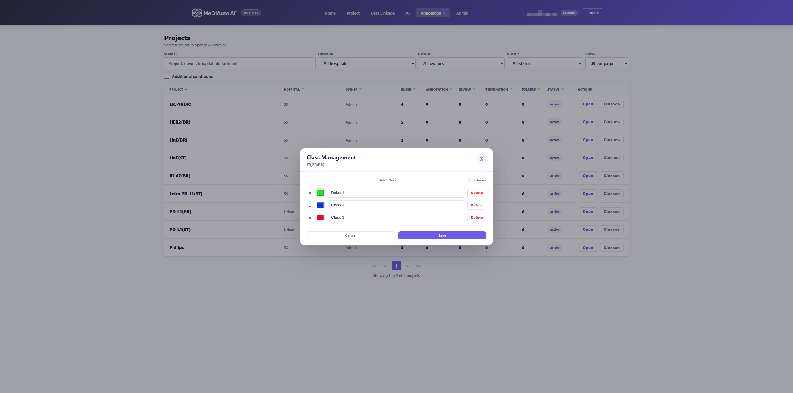

*그림 37. Tissue Annotation 클래스 관리*

- 클래스 추가
- 이름 변경
- 색상 변경
- 순서 변경
- 삭제
- 표시/숨김

클래스는 최소 한 개가 남아 있어야 합니다. 사용 중인 클래스를 삭제하면 기존 주석이 다른 기본 클래스로 이동할 수 있으므로 작업 중에는 클래스 구조를 변경하지 않는 것이 좋습니다.

### 주석에 클래스 지정

방법 1:

1. 오른쪽에서 클래스를 선택합니다.
2. 새 주석을 그립니다.

방법 2:

1. 기존 주석을 선택합니다.
2. 원하는 클래스를 선택합니다.
3. Apply 동작을 사용하거나 숫자 키를 누릅니다.

숫자 `1~9`와 `0`은 클래스 목록의 1~10번째 항목에 해당합니다.

### 주석 목록

- ID를 누르면 주석을 선택합니다.
- ID를 더블클릭하면 해당 주석이 화면 중앙에 오도록 이동합니다.
- 표시 아이콘으로 주석을 숨기거나 다시 표시합니다.
- Memo 영역 또는 행 우클릭으로 메모 창을 엽니다.
- Delete로 해당 주석을 삭제합니다.

### 주석 모양 수정

- 선택 주석의 꼭짓점을 드래그합니다.
- Rectangle은 모서리를 드래그해 크기를 바꿉니다.
- `Shift+드래그`로 선택 주석 전체를 옮깁니다.
- `Alt`를 누르고 polygon 경계에 마우스를 올리면 새 꼭짓점 위치가 표시됩니다.
- 해당 위치를 `Alt+클릭`하면 꼭짓점이 추가됩니다.
- 겹친 같은 클래스 polygon에서 `Ctrl`을 누르면 병합 표시가 나타납니다.
- `Ctrl+클릭`으로 병합합니다.

### 표시 스타일

- `Line`: 선 두께 1~12px
- `Fill`: 내부 채움 0~80%

스타일은 현재 계정의 다른 주석 화면에도 적용될 수 있습니다.

### Slide Memo

- 툴바의 Memo 버튼 또는 `Ctrl+M`으로 엽니다.
- 현재 메모를 작성·수정·삭제합니다.
- 이전 메모 history를 확인합니다.
- 이전 메모에 답변을 작성하고 accept할 수 있습니다.
- 메모가 있는 슬라이드는 목록에 `M` 표시가 나타납니다.

### Annotation Memo

- 주석 목록의 Memo 영역을 누르거나 행을 우클릭합니다.
- 메모와 history를 관리합니다.
- 메모는 선택한 주석에만 연결됩니다.

### 저장

- `Save` 버튼 또는 `Ctrl+S`
- 현재 주석, 클래스 연결, 메모가 저장됩니다.
- 슬라이드를 바꾸기 전에 반드시 저장 상태를 확인합니다.
- `Clear All`은 현재 화면의 모든 주석을 제거하므로 주의합니다.

### Workflow

| 단계 | 의미 |
| --- | --- |
| Annotation | 주석 작성 단계 |
| Review | 작성 결과 검토 단계 |
| Termination | 최종 종결 단계 |

각 단계의 상태는 색과 아이콘으로 구분됩니다.

- 현재 시작 가능한 단계
- Running
- Done
- Pending
- Rejected

기관의 검토 규칙에 따라 Annotation을 완료한 뒤 Review, Termination 순으로 진행합니다. Labeler는 주로 Annotation 단계만 처리하며 Review와 Termination은 Doctor 또는 Admin이 진행합니다.

### Virtual H&E 참고 보기

Tissue Annotation의 오른쪽 AI 영역에서는 VS IHC 기능을 사용할 수 있습니다.

- Virtual H&E 생성
- Overlay
- IHC | Virtual H&E Split View

주석 작업 중 원본과 변환 영상을 비교할 때 사용합니다.

### 주요 단축키

| 입력 | 동작 |
| --- | --- |
| Ctrl/Cmd+S | 현재 주석 저장 |
| Ctrl/Cmd+M | Slide Memo 열기 |
| Ctrl/Cmd+Z | 실행 취소 |
| Ctrl/Cmd+Y | 다시 실행 |
| Ctrl/Cmd+Shift+Z | 다시 실행 |
| 1~9, 0 | 선택 주석 클래스 변경 |
| Delete | 선택 주석 삭제 |
| Esc | 그리기 모드 또는 열린 도움말 닫기 |
| Alt+휠 | Brush 크기 변경 |
| Shift+드래그 | 선택 주석 이동 |
| Ctrl+드래그 | 주석 위에서 화면 이동 |

---

## 11. Cell Annotation 페이지

### 페이지 주소

`/cell-annotation`

### 화면의 역할

WSI에서 라벨링할 영역을 지정하고, 고정 크기 패치 안의 세포를 bounding box와 클래스로 주석합니다. 각 패치는 Annotation, Review, Termination 단계를 따릅니다.

### 전체 작업 순서

1. 프로젝트와 슬라이드를 선택합니다.
2. WSI View에서 Required 영역과 필요한 Exclude 영역을 그립니다.
3. 영역을 Apply하여 작업 패치를 만듭니다.
4. 패치를 선택하고 Patch View로 들어갑니다.
5. Annotation 상태를 Running으로 바꿉니다.
6. AI assistance 결과를 확인하거나 직접 세포를 표시합니다.
7. 셀 클래스와 위치를 수정합니다.
8. 저장 후 Annotation을 Done으로 변경합니다.
9. Doctor/Admin이 Review를 진행합니다.
10. 반려된 패치는 다시 수정하고, 승인된 패치는 Termination을 완료합니다.

### 프로젝트 클래스 설정

프로젝트 선택 화면에서 클래스 설정을 열 수 있습니다.

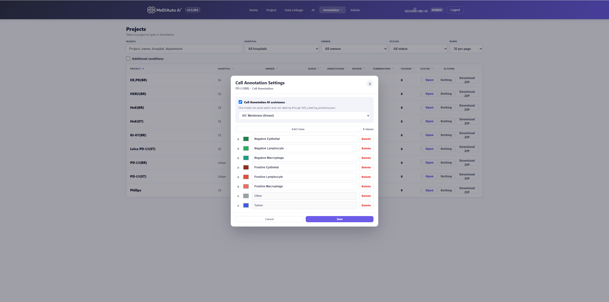

*그림 38. Cell Annotation 프로젝트 클래스 설정*

- 프로젝트에서 사용할 세포 클래스 확인
- Admin/Doctor의 클래스 추가·수정·정렬
- AI가 제공하는 필수 클래스와 Other는 이름·색상 변경 또는 삭제가 제한될 수 있음
- 사용자 정의 클래스는 별도로 유지

작업이 시작된 뒤 클래스 구조를 크게 바꾸면 기존 패치와의 일관성이 깨질 수 있으므로 시작 전에 확정합니다.

### WSI View: Required 영역 만들기

Required는 라벨링이 필요한 영역입니다.

1. Required 모드를 선택합니다.
2. WSI 위에서 대상 조직 영역을 polygon으로 그립니다.
3. 초록색 영역과 생성 예정 patch를 확인합니다.
4. 필요한 영역을 모두 지정한 뒤 `Apply`합니다.

Apply 전에는 `Ctrl+Z`로 마지막 영역 지정을 취소할 수 있습니다.

### Exclude 영역 만들기

Exclude는 작업 대상에서 제외할 영역입니다.

1. Exclude 모드를 선택합니다.
2. 제외할 영역을 polygon으로 그립니다.
3. 빨간색 영역과 제외될 patch를 확인합니다.
4. `Apply`합니다.

Apply하면 Required와 교차하는 패치는 추가되고 Exclude와 교차하는 패치는 제외됩니다. 기존 패치 전체를 다시 만드는 것이 아니라 현재 지정 내용을 추가로 반영합니다.

### 전체 패치 지우기

Admin 또는 Doctor만 사용할 수 있습니다.

- 전체 patch 상태와 cell label을 제거합니다.
- 관련 patch 이미지와 작업 정보도 영향을 받습니다.
- 버튼을 누른 뒤 5초 countdown이 표시됩니다.
- 잘못 누른 경우 countdown이 끝나기 전에 취소합니다.

### 패치 목록

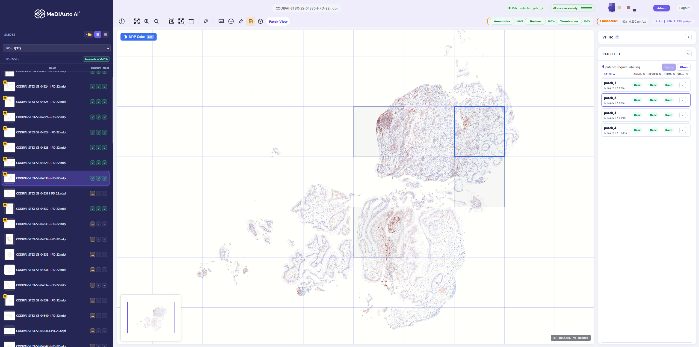

*그림 39. Cell Annotation 패치 목록*

| 열 | 내용 |
| --- | --- |
| Patch | `patch_N` 형식의 패치 번호 |
| Annotation | 작성 상태 |
| Review | 검토 상태 |
| Termination | 종결 상태 |
| Memo | 메모 존재 여부 |

- 열 제목을 눌러 정렬합니다.
- 행을 누르면 패치를 선택합니다.
- 행에서 Enter 또는 Space를 눌러도 선택할 수 있습니다.
- 행을 더블클릭하면 Patch View로 들어갑니다.
- 행을 우클릭하면 Memo 또는 패치 제거 메뉴가 표시됩니다.

### Patch View 열기·닫기

- 선택한 패치를 더블클릭합니다.
- 또는 `P`를 눌러 Patch View로 전환합니다.
- 다시 `P`를 누르면 WSI View로 돌아갑니다.
- WSI View로 돌아갈 때 이전에 보던 위치와 배율이 복원됩니다.
- `Fit Patch`를 누르면 패치가 화면에 맞게 표시됩니다.

### 패치 작업 상태 시작

새 Required 패치는 먼저 Annotation을 Running으로 변경해야 편집할 수 있습니다.

1. Patch View에서 `Annotation` 상태를 확인합니다.
2. 상태 버튼을 눌러 `Running`으로 바꿉니다.
3. 셀을 추가하거나 수정합니다.
4. 작업을 저장합니다.
5. Annotation을 `Done`으로 바꿉니다.

Done으로 바꿀 때 현재 셀 라벨이 먼저 저장됩니다.

### 셀 직접 그리기

- Rectangle 도구를 사용합니다.
- 세포를 둘러싸도록 드래그합니다.
- 현재 선택한 클래스가 새 셀에 적용됩니다.
- 실제 저장 정보는 bounding box입니다.

### BBox와 Point 보기

- `BBox`: 셀의 전체 사각형을 표시합니다.
- `Point`: 셀의 중심점 형태로 간단하게 표시합니다.

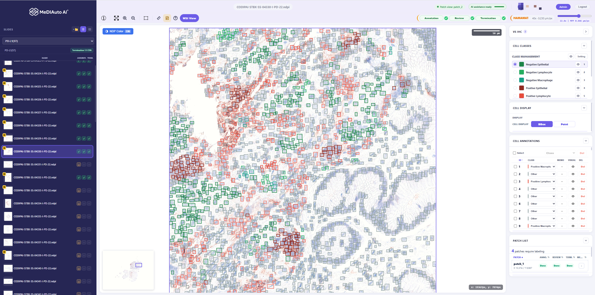

*그림 40. 세포 BBox 표시 방식*

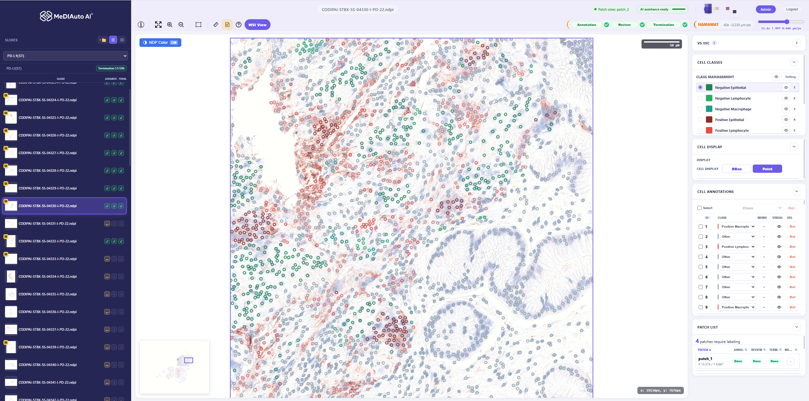

*그림 41. 세포 Point 표시 방식*

표시 방식을 바꾸어도 저장된 bounding box 정보는 유지됩니다.

### 셀 선택

- 셀을 클릭해 단일 선택합니다.
- 목록의 checkbox로 여러 셀을 선택합니다.
- `Alt+클릭`으로 선택을 추가하거나 해제합니다.
- `Alt+드래그`로 여러 셀을 자유 영역 선택합니다.
- 전체 checkbox로 현재 목록의 셀을 한 번에 선택합니다.
- `Esc`로 다중 선택을 해제합니다.

### 셀 클래스 변경

1. 하나 이상의 셀을 선택합니다.
2. 클래스 목록에서 원하는 클래스를 누릅니다.

또는 숫자 `1~9`, `0`으로 클래스 목록의 1~10번째 항목을 적용합니다.

### 셀 삭제

- 셀을 선택합니다.
- `Delete`, `Backspace` 또는 `D`를 누릅니다.
- 여러 셀을 선택한 경우 모두 삭제됩니다.

### 클래스 표시·숨김

| 입력 | 동작 |
| --- | --- |
| Ctrl/Cmd+1~9, 0 | 해당 순번 클래스 표시·숨김 |
| Ctrl/Cmd+` | 모든 클래스 표시·숨김 |

표시를 숨겨도 셀 라벨이 삭제되는 것은 아닙니다.

### AI assistance 사용

프로젝트에 assistance가 설정되어 있으면 다음과 같이 사용합니다.

1. 필요한 WSI 영역과 patch를 먼저 만듭니다.
2. assistance 실행 버튼을 누릅니다.
3. 진행률이 완료될 때까지 기다립니다.
4. 비어 있는 Required patch를 엽니다.
5. 자동으로 불러온 셀 라벨을 검토합니다.
6. 잘못된 클래스, 위치, 누락 셀을 수정합니다.
7. 저장하고 Annotation을 Done으로 변경합니다.

이미 수동 라벨이 있는 패치에는 assistance가 자동으로 덮어쓰지 않습니다. AI 결과는 최종 정답이 아니라 라벨링 보조 결과이므로 반드시 사람이 검토합니다.

### Patch Workflow

#### Annotation

- `Required`: 작업 필요
- `Running`: 작성 중
- `Done`: 작성 완료

#### Review

- `Pending`: 검토 전
- `Done`: 검토 완료
- `Rejected`: 수정 필요

#### Termination

- `Pending`: 종결 전
- `Current`: 종결 진행 단계
- `Done`: 종결 완료

Review가 Rejected이면 해당 패치는 다시 Annotation 편집이 가능합니다.

### Labeler 작업 범위

Labeler는 다음 조건에서 패치 셀을 편집할 수 있습니다.

- Annotation이 Running
- 또는 Review가 Rejected

Labeler는 다음 작업을 할 수 없습니다.

- WSI Required/Exclude 영역 설정
- 패치 제거
- Review 상태 변경
- Termination 상태 변경
- 패치 Memo 변경

### Patch Memo

- 패치 행을 우클릭하거나 Memo 항목을 선택합니다.
- 현재 메모와 history를 확인합니다.
- 답변과 accept 상태를 관리합니다.
- Labeler는 Memo 변경이 제한됩니다.

### 프로젝트 진행률 확인

- 슬라이드 목록에서 Annotation, Review, Termination 완료율을 확인합니다.
- 반려 패치는 별도 색상으로 표시됩니다.
- 프로젝트 상단에서 Termination 완료 패치 수와 전체 패치 수를 비교합니다.

### 주요 단축키

| 입력 | 동작 |
| --- | --- |
| P | WSI View와 Patch View 전환 |
| Ctrl/Cmd+S | 현재 패치 저장 |
| Ctrl/Cmd+Z | 적용 전 영역 또는 셀 편집 실행 취소 |
| Ctrl/Cmd+Y | 다시 실행 |
| Ctrl/Cmd+Shift+Z | 다시 실행 |
| 1~9, 0 | 선택 셀 클래스 지정 |
| Ctrl/Cmd+1~9, 0 | 클래스 표시·숨김 |
| Ctrl/Cmd+` | 전체 클래스 표시·숨김 |
| Delete/Backspace/D | 선택 셀 삭제 |
| Alt+클릭 | 셀 선택 추가·해제 |
| Alt+드래그 | 여러 셀 자유 영역 선택 |
| Esc | 선택 또는 그리기 취소 |
| Patch 행 Enter/Space | 패치 선택 |
| Patch 행 더블클릭 | Patch View 열기 |
| Patch 행 우클릭 | Patch 메뉴 열기 |

---

## 12. Data Linkage 페이지

### 페이지 주소

`/data-linkage`

### 화면의 역할

같은 케이스에 속한 슬라이드를 모아 보고 케이스 공통 임상정보를 입력합니다.

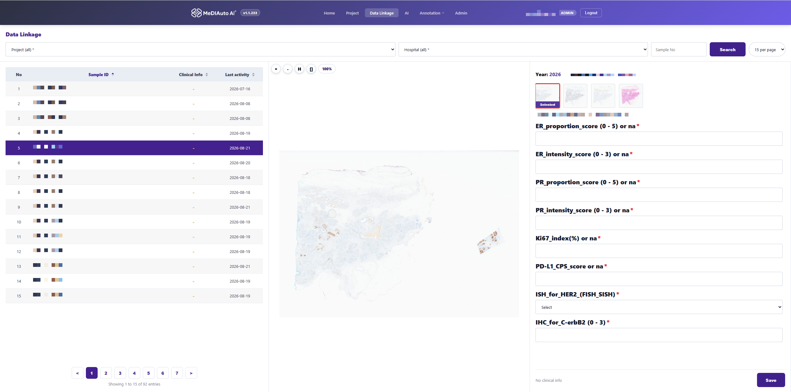

*그림 42. Data Linkage 케이스 및 임상정보 화면*

### 케이스 검색

1. 필요한 경우 Project를 선택합니다.
2. 필요한 경우 Hospital을 선택합니다.
3. `Sample No`에 검색어를 입력합니다.
4. `Search`를 누르거나 Enter를 누릅니다.
5. 페이지당 15, 30, 50개 중 원하는 개수를 선택합니다.

### 목록 정렬

다음 열 제목을 눌러 정렬합니다.

- Case ID
- Clinical Information 보유 여부
- Last Activity

같은 제목을 다시 누르면 정렬 방향이 바뀝니다.

### 케이스 선택

케이스를 선택하면 오른쪽에서 다음 내용을 확인합니다.

- Year
- Sample ID
- 연결된 슬라이드 thumbnail
- 현재 선택한 슬라이드
- 임상정보 입력란

### 연결 슬라이드 확인

- 썸네일을 눌러 preview 슬라이드를 바꿉니다.
- 마우스 휠로 cursor 위치를 중심으로 확대·축소합니다.
- preview를 드래그해 이동합니다.
- `+`와 `-` 버튼으로 확대·축소합니다.
- `H` 버튼으로 원래 보기로 되돌립니다.
- `[]` 버튼으로 화면에 맞춥니다.

`H`와 `[]`는 버튼 모양이며 키보드 단축키가 아닙니다.

### 임상정보 입력

- ER proportion score
- ER intensity score
- PR proportion score
- PR intensity score
- Ki67 index
- PD-L1 CPS score
- ISH for HER2
- IHC for C-erbB2

입력값이 없거나 해당하지 않는 경우 기관 규칙에 따라 `na`를 사용합니다.

### 저장

1. 값을 입력하거나 수정합니다.
2. `Not saved` 표시를 확인합니다.
3. `Save`를 누릅니다.
4. 저장 완료 상태를 확인한 뒤 다른 케이스로 이동합니다.

저장하지 않은 변경이 있으면 페이지를 나갈 때 경고가 표시됩니다.

### 주의사항

- 임상정보는 개별 슬라이드가 아니라 같은 케이스에 공유될 수 있습니다.
- 값을 변경하면 연결된 다른 marker 슬라이드에도 같은 정보가 표시될 수 있습니다.
- 점수 입력 형식은 프로젝트 또는 기관의 데이터 입력 규칙을 따릅니다.

---

## 13. Profile 페이지

### 페이지 주소

`/profile`

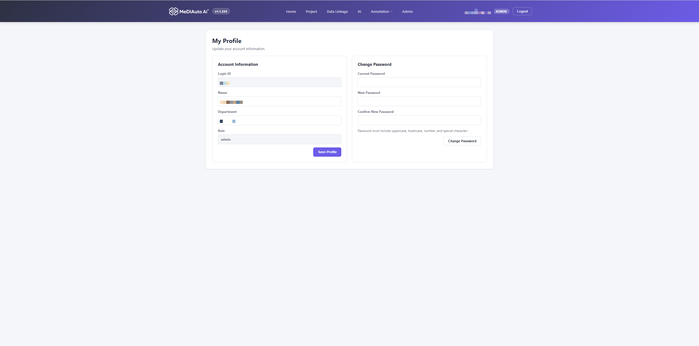

*그림 43. Profile 계정 정보 및 비밀번호 관리*

### 내 정보 수정

1. 상단의 사용자 이름을 누릅니다.
2. `My Profile`에서 현재 정보를 확인합니다.
3. `Name`과 `Department`를 수정합니다.
4. `Save Profile`을 누릅니다.

`Login ID`와 `Role`은 직접 변경할 수 없습니다. 변경이 필요하면 관리자에게 요청합니다.

### 비밀번호 변경

1. `Current Password`에 현재 비밀번호를 입력합니다.
2. `New Password`에 새 비밀번호를 입력합니다.
3. `Confirm New Password`에 같은 비밀번호를 다시 입력합니다.
4. `Change Password`를 누릅니다.
5. 변경이 완료되면 다시 로그인합니다.

새 비밀번호도 대문자, 소문자, 숫자, 특수문자를 포함한 8자 이상이어야 합니다.

비밀번호를 변경하면 현재 로그인 중인 다른 기기나 브라우저에서도 다시 로그인해야 할 수 있습니다.

---

## 14. Admin 페이지

### 페이지 주소

`/admin`

Admin 역할만 사용할 수 있습니다.

### Pending: 가입 승인

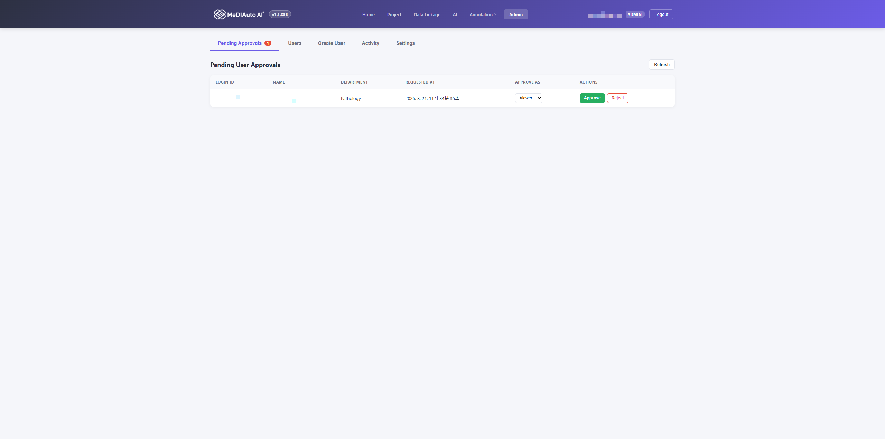

*그림 44. Admin Pending 가입 승인*

1. `Pending` 탭을 엽니다.
2. 신청자의 이름, Login ID, 부서를 확인합니다.
3. 승인할 역할을 선택합니다.
   - Viewer
   - Labeler
   - Doctor
   - Admin
4. `Approve`를 누릅니다.

가입을 허용하지 않으려면 `Reject`를 누르고 필요한 경우 사유를 입력합니다.

역할은 실제 업무 범위에 맞게 최소 권한으로 지정하는 것이 좋습니다.

### Users: 사용자 관리

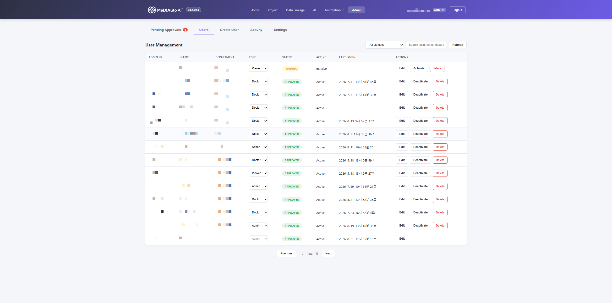

*그림 45. Admin 사용자 관리*

- 상태별 필터
- 이름 또는 Login ID 검색
- 사용자 이름과 부서 수정
- 필요한 경우 새 비밀번호 지정
- 역할 변경
- 계정 활성·비활성 전환
- 잠긴 계정 Unlock
- 사용자 삭제
- 목록 페이지 이동

본인 계정이나 마지막 Admin 계정에는 일부 위험한 동작이 제한됩니다.

### Create: 사용자 직접 생성

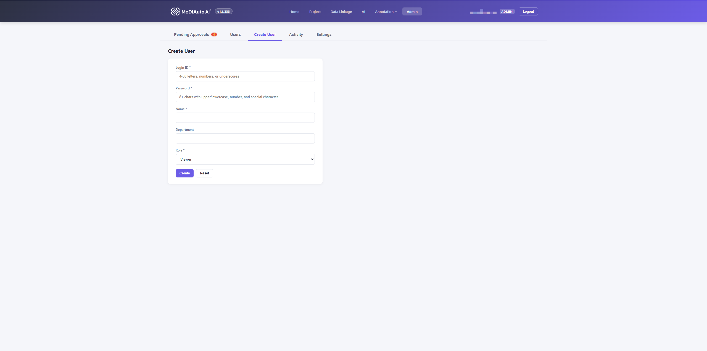

*그림 46. Admin 사용자 직접 생성*

1. `Create` 탭을 엽니다.
2. Login ID, Name, Department를 입력합니다.
3. 초기 Password를 설정합니다.
4. Role을 선택합니다.
5. 생성합니다.

관리자가 직접 만든 계정은 바로 사용할 수 있습니다. 초기 비밀번호는 안전한 방법으로 사용자에게 전달하고 첫 로그인 후 변경하도록 안내합니다.

### Activity: 로그인·작업 기록 확인

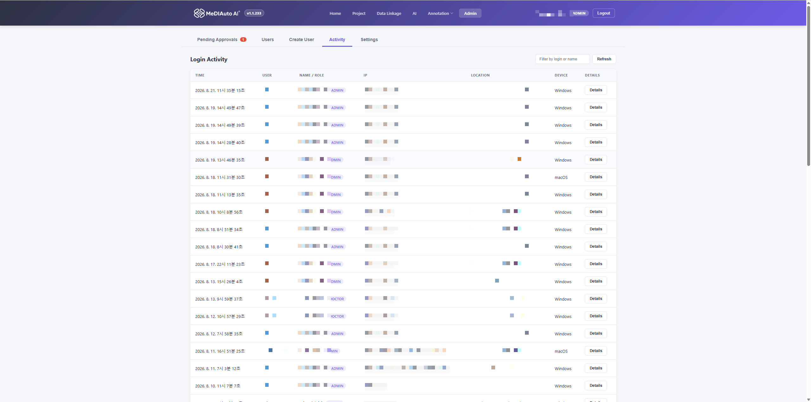

*그림 47. Admin 로그인 활동 기록*

- 사용자별 로그인 활동
- 날짜와 시각
- IP 주소와 위치
- 사용 장치 정보
- 사용자별 상세 기록

사용자 상세 화면에서는 다음 범주를 선택할 수 있습니다.

- All
- Login
- Slides
- AI
- Projects
- Files

날짜 범위와 페이지를 변경해 필요한 기록을 찾습니다.

### Settings: 백그라운드 작업 관리

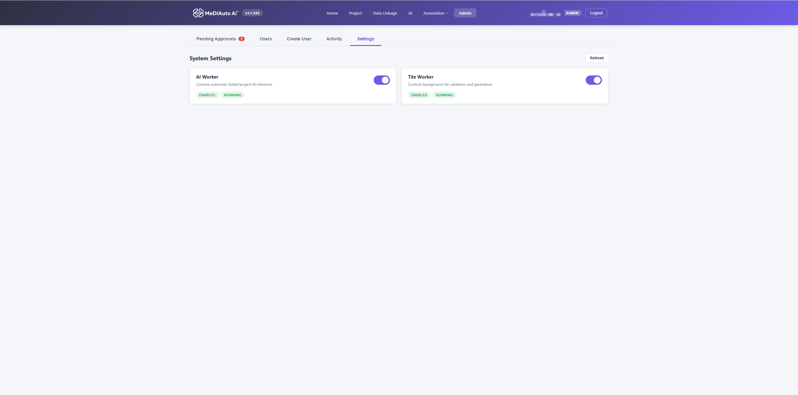

*그림 48. Admin 백그라운드 작업 설정*

#### AI Worker

프로젝트 또는 폴더에 설정한 자동 AI 작업을 켜거나 끕니다.

#### Tile Worker

업로드된 슬라이드의 Viewer용 타일 준비 작업을 켜거나 끕니다.

각 카드에서 다음 두 상태를 구분합니다.

- `Enabled`: 사용하도록 설정되었는지
- `Running`: 현재 작업 프로세스가 동작 중인지

설정을 변경한 뒤 상태가 갱신되는지 확인합니다. 일반 운영 중에는 특별한 점검 사유가 없다면 두 작업을 켜 두는 것이 좋습니다.

---

## 15. 단축키 빠른 참조

macOS에서는 대부분의 `Ctrl` 조합을 `Cmd`로 사용할 수 있습니다.

### Viewer와 주석

| 입력 | 동작 |
| --- | --- |
| 마우스 휠 | WSI 확대·축소 |
| 좌클릭/가운데 버튼 드래그 | 화면 이동 |
| Ctrl+드래그 | 주석 위 또는 그리기 중 화면 이동 |
| Ctrl+클릭 | 그리기 모드에서도 주석 선택 |
| Shift+드래그 | 선택 주석 전체 이동 |
| Delete | 선택 주석 삭제 |
| Esc | 그리기·선택·팝업 취소 |
| Ctrl+Z | 실행 취소 |
| Ctrl+Y | 다시 실행 |
| Ctrl+Shift+Z | 다시 실행 |
| Alt+휠 | Polygon Brush 크기 변경 |
| Alt+polygon 경계 클릭 | 꼭짓점 추가 |
| Ctrl+겹친 같은 클래스 polygon 클릭 | polygon 병합 |

### Tissue Annotation

| 입력 | 동작 |
| --- | --- |
| Ctrl+S | 주석 저장 |
| Ctrl+M | Slide Memo |
| 1~9, 0 | 선택 주석 클래스 지정 |

### AI 결과 편집

| 입력 | 동작 |
| --- | --- |
| Alt+좌클릭 | 결과 셀 편집 |
| Alt+좌드래그 | 가시 셀 다중 선택 |
| Alt+우클릭 | 새 셀 추가 |
| Alt+우드래그 | 숨겨진 Other 셀 다중 선택 |
| Alt+A | Sticky Class 선택 |
| 1~9, 0 | 편집창에서 클래스 지정 |
| Delete/D | 결과 셀 삭제 |

### Cell Annotation

| 입력 | 동작 |
| --- | --- |
| P | WSI/Patch View 전환 |
| Ctrl+S | 패치 저장 |
| 1~9, 0 | 선택 셀 클래스 지정 |
| Ctrl+1~9, 0 | 클래스 표시·숨김 |
| Ctrl+` | 전체 클래스 표시·숨김 |
| Delete/Backspace/D | 선택 셀 삭제 |
| Alt+클릭 | 셀 선택 추가·해제 |
| Alt+드래그 | 셀 다중 선택 |

### 슬라이드·패치 목록

| 입력 | 동작 |
| --- | --- |
| Ctrl/Cmd+클릭 | 슬라이드 다중 선택 |
| Shift+클릭 | 슬라이드 범위 선택 |
| 빈 영역 드래그 | 사각 영역 다중 선택 |
| Ctrl+휠 | 슬라이드 썸네일 크기 변경 |
| Patch 행 Enter/Space | 패치 선택 |
| Patch 행 더블클릭 | Patch View 열기 |

---

## 16. 작업 전 확인사항

### AI 분석 전

- 올바른 프로젝트와 슬라이드를 열었는지 확인합니다.
- 조직에 맞는 모델과 variant를 선택합니다.
- ROI 분석이면 필요한 ROI만 보이는 상태인지 확인합니다.
- 이전 결과를 유지해야 하면 새 분석 전에 저장 상태를 확인합니다.

### Tissue Annotation 저장 전

- 올바른 클래스가 지정되었는지 확인합니다.
- 숨겨진 클래스나 주석이 없는지 확인합니다.
- Slide Memo와 Annotation Memo를 구분합니다.
- Workflow 상태를 바꾸기 전에 저장합니다.

### Cell Annotation 완료 전

- AI assistance 결과를 사람이 검토했는지 확인합니다.
- 누락 셀과 잘못된 클래스가 없는지 확인합니다.
- 숨긴 클래스가 있는지 확인합니다.
- Annotation Done 전에 현재 패치가 저장되는지 확인합니다.
- Review Rejected 사유 또는 Memo를 확인하고 수정합니다.

### 파일 삭제·덮어쓰기 전

- 선택한 프로젝트, 폴더, 파일명을 다시 확인합니다.
- Overwrite나 Delete는 기존 AI 결과와 주석에도 영향을 줄 수 있습니다.
- 필요한 결과를 먼저 내보내거나 별도로 보관합니다.

---

## 17. 자주 발생하는 상황

### AI 버튼이 비활성화되어 있습니다

- Viewer 역할인지 확인합니다.
- 슬라이드가 정상적으로 열렸는지 확인합니다.
- 다른 AI 작업이 실행 중인지 확인합니다.
- 프로젝트 설정 또는 관리자 상태를 확인합니다.

### 주석을 수정할 수 없습니다

- Viewer 역할은 수정할 수 없습니다.
- Cell Annotation의 Labeler는 Annotation Running 또는 Review Rejected 상태에서만 수정할 수 있습니다.
- 올바른 Patch View를 열었는지 확인합니다.

### 슬라이드가 선명하게 표시되지 않습니다

- 타일이 준비되는 동안 잠시 낮은 해상도 화면이 표시될 수 있습니다.
- 로딩이 끝날 때까지 기다립니다.
- Fit 후 다시 확대합니다.
- 계속 문제가 있으면 페이지를 새로고침하거나 관리자에게 문의합니다.

### 같은 케이스 슬라이드가 검색되지 않습니다

- 파일명이 기관의 케이스 명명 규칙에 맞는지 확인합니다.
- 다른 프로젝트에 파일이 정상 등록되어 있는지 확인합니다.
- 파일명의 케이스 구간이 서로 같은지 확인합니다.

### 업로드 후 슬라이드가 보이지 않습니다

- 업로드 결과가 `Uploaded`인지 확인합니다.
- 올바른 프로젝트와 폴더를 보고 있는지 확인합니다.
- 목록을 새로고침합니다.
- 파일 검사 실패 메시지가 있었는지 확인합니다.

### PDF가 저장되지 않습니다

- 브라우저의 다운로드 차단 여부를 확인합니다.
- 저장 위치 선택 창이 다른 창 뒤에 열리지 않았는지 확인합니다.
- 폐쇄망 환경이면 관리자에게 PDF 기능 설정을 문의합니다.
